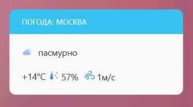
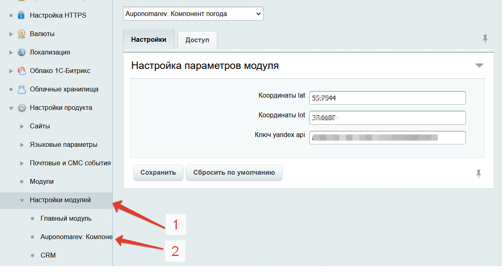

# Модуль для битрикс 24

Модуль получает данные о погоде из Яндекс.Погода, и отображает в виджете.  


# Установка. 
- Модуль необходимо перенести на портал от корневого каталога сайта по следующему пути /local/modules/
- Модуль необходимо установить, как партнерский модуль в административном разделе http://{your_site}/bitrix/admin/partner_modules.php
- Модуль необходимо настроить, указать координаты места, и ключ доступа к Яндекс.Погоде ([Получить ключ](https://yandex.ru/pogoda/b2b/console/api-page "Получить ключ")) 
 
- Добавить вывод компонента, например, вывод на странице Новости в правой вертикальной колонке (под пульсом компании).
```  
if (CModule::IncludeModule('auponomarev.weatherapi'))
{
    $APPLICATION->IncludeComponent('custom:auponomarev.weatherapi', '', array("CACHE_TIME" => 3600,),	false);
}
```
